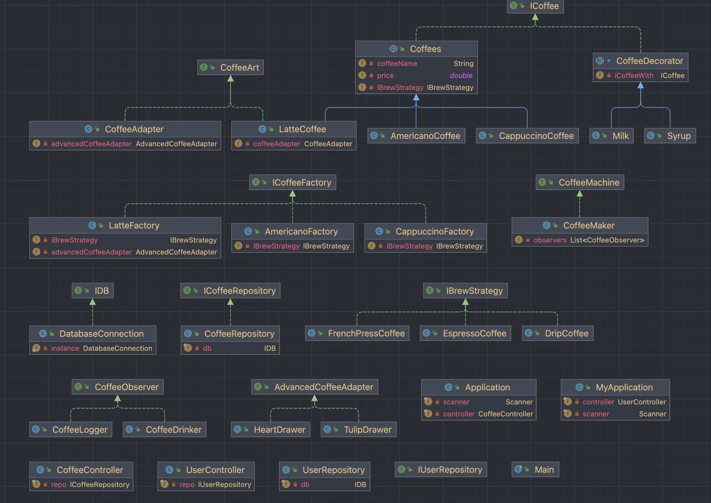

# SDP FINAL




## Patterns

- **Adapter**: Need to adapt coffee method draw to draw a art in Coffee Machine in class and 2 types of Arts
1. Heart
2. Tulip

``` java
public class CoffeeAdapter implements CoffeeArt {
    private AdvancedCoffeeAdapter advancedCoffeeAdapter;

    public void setAdvancedImgViewer(AdvancedCoffeeAdapter advancedImgViewer) {
        this.advancedCoffeeAdapter = advancedCoffeeAdapter;
    }

    public CoffeeAdapter(AdvancedCoffeeAdapter advancedCoffeeAdapter) {
        this.advancedCoffeeAdapter = advancedCoffeeAdapter;
    }

    @Override
    public String draw() {
        return advancedCoffeeAdapter.drawTulip() + advancedCoffeeAdapter.drawHeart();
    }
}
```

- **Singleton**: For database

``` java
        IDB db = DatabaseConnection.getInstance();
        ICoffeeRepository repo = new CoffeeRepository(db);
        CoffeeController controller = new CoffeeController(repo);
        Application app = new Application(controller);
        app.start();
```

- **Factory**: Need to create 3 types of coffee
1. **Latte**
2. **Americano**
3. **Cappuccino**
``` java
package CoffeeFactoryPac;

import CoffeeFactoryPac.ICoffeePac.ICoffee;
import CoffeeStrategy.IStrategyCoffee.IBrewStrategy;

public abstract class Coffees implements ICoffee {
    private double price;
    private String coffeeName;
    private IBrewStrategy iBrewStrategy;


    public Coffees(double price, String coffeeName, IBrewStrategy iBrewStrategy) {
        this.price = price;
        this.coffeeName = coffeeName;
        setIBrewStrategy(iBrewStrategy);
    }
    @Override
    public double getCost() {
        return this.price;
    }

    @Override
    public String getDescription() {
        return this.coffeeName + " | " + iBrewStrategy.brew() + " | ";
    }

    public void setIBrewStrategy(IBrewStrategy iBrewStrategy) {
        this.iBrewStrategy = iBrewStrategy;
    }
}

```

- **Observer**: Should to get email that coffee is done
``` java
public interface CoffeeMachine {
    void addObserver(CoffeeObserver observer);
    void removeObserver(CoffeeObserver observer);
    void notifyObservers();
}
```
``` java
public interface CoffeeObserver {
    void update();
}
```
- **Strategy**: Create 3 strategy of brew
1. **Drip**
2. **Espresso**
3. **FrenchPress**
``` java
public interface IBrewStrategy {
    String brew();
}
```

- **Decorator**: Create Milk or Syrup to add on Coffee
``` java
import CoffeeFactoryPac.ICoffeePac.ICoffee;

abstract class CoffeeDecorator implements ICoffee {
    private ICoffee iCoffeeWith;

    public CoffeeDecorator(ICoffee iCoffeeWith) {
        this.iCoffeeWith = iCoffeeWith;
    }

    @Override
    public double getCost() {
        return iCoffeeWith.getCost();
    }

    @Override
    public String getDescription() {
        return iCoffeeWith.getDescription();
    }
}
```
